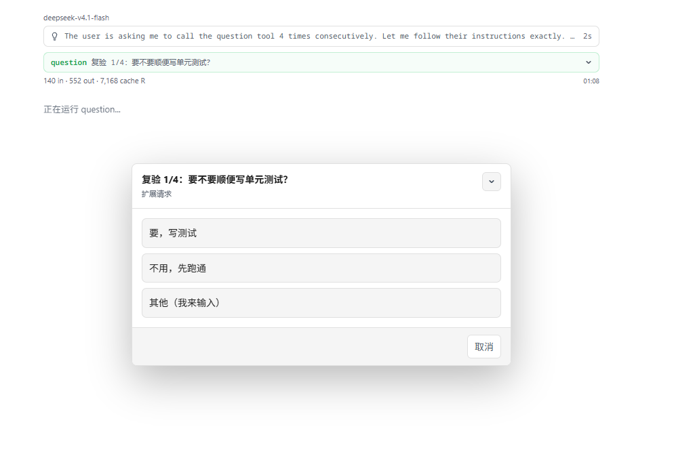

# pi-question

> 仓库：<https://github.com/JESVN/PIWebExtensions>（子目录 `pi-question/`）· 许可：[MIT](LICENSE)

为 **[pi-web](https://github.com/agegr/pi-web)** 开发的 pi 扩展：让模型用「可点击选项」向你提问。

pi-web 是 [pi coding agent](https://github.com/earendil-works/pi) 的 Web UI。
pi 的内置工具只有 `read / bash / edit / write / grep / find / ls`，**没有任何提问工具**；
而 pi-web 早已支持把扩展的 `select` 渲染成可点击卡片、把 `input` 渲染成输入框——本扩展就是把两者接上。

在 pi-web 里，模型需要你做决策时不再写 1/2/3 让你打字数数，而是弹出一个**可点击卡片**的对话框；
你也可以选「其他（我来输入）」自由作答；点错「其他」后在输入框按 `Esc` / 点「取消」/ 直接空提交即可**退回选项列表**；
在选项列表上取消（或按 `Esc`）会明确告诉模型「用户取消了」，避免它自己编答案。

## 效果



> 截图来自 pi-web：对话框标题就是模型的问题，每个选项渲染成一张可点击卡片，
> 「其他（我来输入）」可自由作答（在输入框按 `Esc` / 点「取消」/ 空提交会退回本列表）。

## 上游与运行环境

本扩展只调用 pi 的扩展 UI 协议（`ctx.ui.select()` / `ctx.ui.input()`），**不含任何 UI 渲染代码**；
界面由 pi-web 负责画。以下是实测过的版本：

| 上游仓库 | 包 / 版本（实测） | 本项目对它的依赖 |
|---|---|---|
| [agegr/pi-web](https://github.com/agegr/pi-web) | `@agegr/pi-web` v0.9.3（加载/冒烟测试）；v0.9.1（手工验收） | **主运行环境**：把 `extension_ui_request` 的 `select` 画成原生网页卡片、`input` 画成输入框 |
| [earendil-works/pi](https://github.com/earendil-works/pi)（`packages/coding-agent`） | `@earendil-works/pi-coding-agent` 0.87.1（加载/冒烟测试）；0.85.1（手工验收） | 内核：扩展加载（jiti，免编译）与 RPC 的 `extension_ui_request` / `extension_ui_response` 协议 |

> pi CLI/TUI 也能用（`ctx.ui.select()` 会渲染成终端选择列表），但它是次要环境：
> pi-web 下 `ctx.mode === "rpc"`、`hasUI === true`，而入参 `description`、输入框 `placeholder` 等只在 pi-web 里完整展现。

## 安装

### 方式一：符号链接（开发期推荐）

```bash
mkdir -p ~/.pi/agent/extensions
ln -sfn "$(pwd)/extensions/question.ts" ~/.pi/agent/extensions/question.ts   # 在仓库根目录执行
```

修改 `extensions/question.ts` 后，在 pi-web **任一会话执行 `/reload`** 生效
（内核有按 cwd 的模块缓存，仅新建会话可能读到旧代码）；不要重启 pi-web。

### 方式二：作为 pi 包安装（长期）

```bash
pi install "$(pwd)"   # 在仓库根目录执行
```

注意：两种方式不要同时使用，否则 `question` 工具会重复注册。

> 换机器 / 首次安装的完整步骤（含内核路径定位、验收流程）见 `AGENTS.md` 的「新机器安装（bootstrap）」。

## 用法

直接对模型说：

> 用 question 工具问我：这个功能现在实现吗？选项给「现在做」「等等再说」。

模型在有多个具体选项需要你拍板时会自动调用（系统提示里带了使用指引）。

> 想一次跑完全部交互分支（选选项 / 「其他」输入 / 输入框按 Esc 回退 / 选项层取消），
> 用 [DESIGN.md](DESIGN.md) 里的**「验收脚本」**一节：一条消息里让模型连续调用 4 次 `question`，
> 之后每一轮弹窗由你点即可（模型不会自己「再次调用」）。

## 行为约定

| 你的操作 | 模型收到 |
|---|---|
| 点选某个选项 | 该选项的原始 `label`（不含展示用的 Markdown 修饰） |
| 选「其他（我来输入）」并提交 | 你输入的原文（已 trim） |
| 在输入框按 `Esc` / 点「取消」/ 空提交 | 什么都不发：**退回选项列表**重新选择 |
| 在选项列表点取消 / 按 `Esc`（含 `Stop` 中断） | 明确的「用户取消」文案，模型不得臆测答案 |
| 无交互界面（如 `pi -p`） | 优雅返回说明，不崩溃 |

> 通知提示：pi-web 页面切到后台/失焦时，question 弹窗会触发系统通知「Pi 需要你的操作」
> （正文为问题文本，点击回到会话）；若浏览器完全关闭则不会收到提醒（任务完成通知不受影响）。

## 文档

- [DESIGN.md](DESIGN.md) —— 设计说明与契约（返回文案、`details` 结构、交互语义、验收脚本）
- [AGENTS.md](AGENTS.md) —— 给 AI agent 的开发指南（怎么改、怎么验证、硬性约束）
- [CHANGELOG.md](CHANGELOG.md) —— 版本历史
- [LICENSE](LICENSE) —— MIT

## 开发

```bash
# 冒烟测试：仓库不内置任何本机路径，用 PI_KERNEL_DIR 指向 pi 内核包
PI_KERNEL_DIR="<pi-web 安装目录>/node_modules/@earendil-works/pi-coding-agent" node test/smoke.mjs
```

## 许可

[MIT](LICENSE) © 2026 pi-question contributors

> 上游 [pi-web](https://github.com/agegr/pi-web) 与 [pi](https://github.com/earendil-works/pi) 各自按自己的许可（均为 MIT）分发；
> 本仓库不包含它们的代码，只通过 pi 的扩展接口调用。
